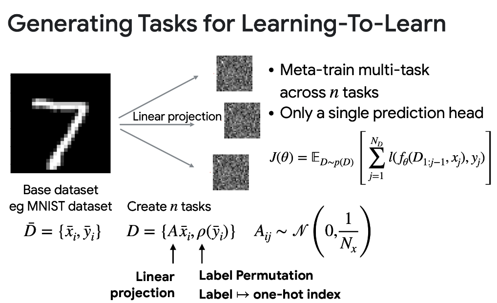
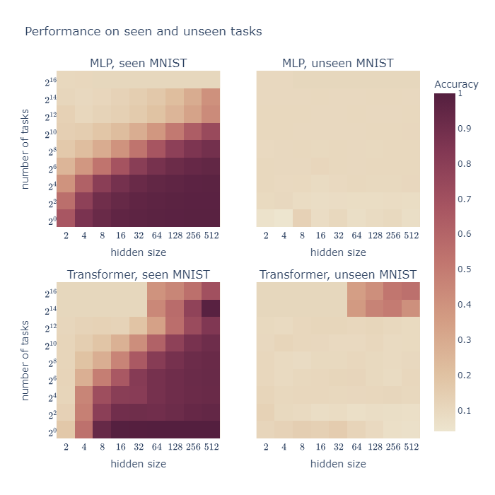
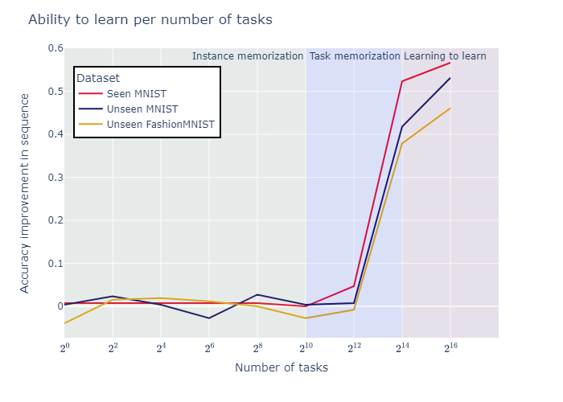
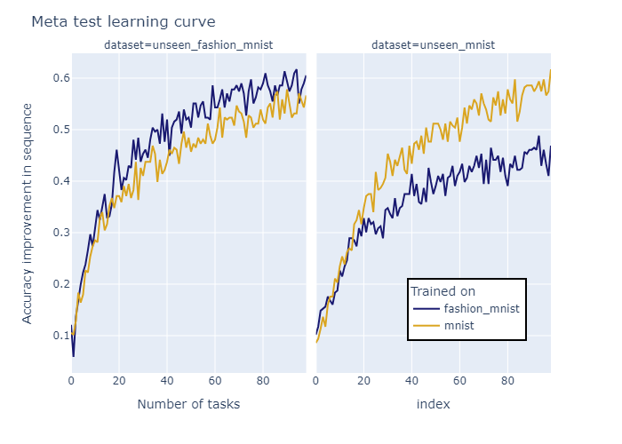

## Report 

This is a report on reproducing the results of the paper [GPICL: General Purpose In Context Learning](https://arxiv.org/pdf/2212.04458.pdf). It discusses the remarkable property of transformers to learn to learn (meta-learning) when provided with a sufficient amount of data. This does not require unique data; the effect can be achieved using standard transformations like linear projection and permutation. We will also examine how good transformers are at meta-learning, whether they truly generalize, and under what parameters this occurs. For code details, refer to the modules and notebooks; they can be executed block by block, as all dependencies are included. The file list is available at the bottom of the report in the table of contents and via links in the subheadings. Only general descriptions are provided here.

### [1. Data augmentations](https://nbviewer.org/github/Lerostre/gpicl/blob/main/1.%20Task%20generation.ipynb)

The main idea of the paper is that we do not need massive amounts of data or complex augmentations to train a model with strong generalization capabilities. The core concept is to take an existing dataset and, through simple transformations—linear projection of inputs and permutation of targets—generate an arbitrarily large sample. Below is how this is supposed to look conceptually:

This part is implemented in the `TaskAugmentor` class. However, the authors note that this can be a highly labor-intensive process, requiring up to 16 GPUs. This is indeed true; generation, sampling, and storage consume a lot of time. The processes are partially optimized, but there is room for improvement.

### [2. Parameter impact](https://nbviewer.org/github/Lerostre/gpicl/blob/main/2.%20Hparam%20sweep.ipynb)

Training neural networks involves feeding them as many diverse objects and tasks as possible to ultimately obtain a model capable of solving a wide variety of tasks. The authors investigate the optimal number of augmentations and model complexity needed to achieve this effect. 

We will observe this using a perceptron and a transformer as examples. The paper apparently uses an encoder-decoder architecture, whereas here a decoder-only architecture is used. The input data format is not explicitly detailed in the paper, although it is stated to be $[x_1, ... x_n, y_1, ... y_m]$ - a concatenation of the input and the target. But how does one project from $\mathbb{R}$ into a discrete number of embeddings? It is possible that the results are not as impressive due to this, but the effect is still present.

The graph shows an interesting property. A perceptron, regardless of the number of parameters, can only memorize tasks but not generalize. A transformer, given enough data, starts operating as a meta-model—it learns directly from the context. This is truly remarkable, and we will explore it in more detail below.

### [3. Model comparison](https://nbviewer.org/github/Lerostre/gpicl/blob/main/3.%20Model%20comparison.ipynb) 

The transformer is not the only architecture that can be studied in this regard. At the very least, there is also `LSTM` (we use a standard one; we couldn't implement the $\text{Outer-product-LSTM}$ from the paper as it is too time-consuming), $\text{VSML}$ (missing, written in `jax`, didn't have time to figure it out although we found the code), and $\text{MAML}$ (ready, but ran out of time).

We will compare their performance as follows:

1. `MLP` and `MAML` are linear models; we will feed them 99 examples, perform gradient descent, and evaluate accuracy on the 100th.
2. `LSTM` and `Transformer` are seq2seq models; they will take 99 objects, and accuracy will be evaluated on the final context vector for the 100th example.

Training is done on an augmented $\text{MNIST}$ with $2^{16}$ tasks. The paper's results are much more impressive, but the core phenomenon is visible here too.

The paper reported the following metrics:

$$
\begin{array}{lllc}
\hline \text{**Method / Dataset** } & \text{**MNIST**} & \text{**Fashion MNIST** }  & \text{**KMNIST** } & \text{**CIFAR10** } & \text{**SVHN** }\\
\hline \text {SGD} & \text{0.7031} & \text{0.5078}  & \text{0.3789} & \text{0.1484} & \text{0.1016} \\
\text {LSTM (outer-product)} & \text{0.2539} & \text{0.2812}  & \text{0.1810} & \text{0.1211} & \text{0.1107} \\
\text {GPICL Transformer} & \text{0.7370} & \text{0.6224}  & \text{0.5339} & \text{0.1940} & \text{0.1458} \\
\hline
\end{array}
$$

And here are our results:

$$
\begin{array}{lllc}
\hline \text{**Method / Dataset** } & \text{**MNIST**} & \text{**Fashion MNIST** }  & \text{**KMNIST** } & \text{**CIFAR10** } & \text{**SVHN** }\\
\hline \text {MLP} & \text{0.370968} & \text{0.225806}  & \text{0.096774} & \text{0.081967} & \text{0.049180} \\
\text {LSTM} & \text{0.109375} & \text{0.095052}  & \text{0.098958} & \text{0.104167} & \text{0.102865} \\
\text {GPT (GPICL)} & \text{0.523438} & \text{0.458333}  & \text{0.350260} & \text{0.114583} & \text{0.088542} \\
\hline
\end{array}
$$

Unfortunately, it is hard to pinpoint what exactly went wrong in our case, but all models show noticeably worse performance. For the transformer, this might be due to the decoder-only architecture, but the perceptron's performance remains unclear. It might be related to the fact that all inputs were 28x28x1 instead of 32x32x3 as in the paper. This was done purely to save memory.

Nevertheless, the transformer once again demonstrates that it has learned properties that allow it to show decent performance on completely unseen datasets. Most likely, this potential can be significantly expanded. The only problem is that it hits a plateau and is genuinely difficult to train, as evidenced on [wandb](https://wandb.ai/lerostre/gpicl?workspace=user-lerostre).

### [4. In-context learning](https://nbviewer.org/github/Lerostre/gpicl/blob/main/4.%20Sequence%20metatest.ipynb)

To ensure that $\text{GPICL}$ actually draws information from the context, let's look at how it depends on this context. First, let's examine the accuracy improvement within the sequence. If it equals 0, it means the model does not care whether it receives 0 objects or all 100 as input; it has simply memorized the optimal answer or the optimal solution to the task. We, however, want it to learn how to learn the task. The graph below illustrates this:

It is evident that starting from a certain point, around $2^{14}$ tasks, a phase transition occurs—the model truly becomes a meta-model.

Another aspect to examine is how exactly this improvement happens. We can measure accuracy as a function of the number of provided inputs. If it grows, it means the model is actually extracting knowledge. If not, the model is just memorizing:

Once again, we see that the transformer exhibits this property, which means it can potentially be used to solve any task. Isn't that a miracle?

### Repository Contents

- [**1. Task generation.ipynb**](https://nbviewer.org/github/Lerostre/gpicl/blob/main/1.%20Task%20generation.ipynb) - Detailed description of how to generate new tasks for the GPICL training problem, along with examples.
- [**2. Hparam sweep.ipynb**](https://nbviewer.org/github/Lerostre/gpicl/blob/main/2.%20Hparam%20sweep.ipynb) - Examines why the transformer can generalize while the perceptron only memorizes; evaluates performance on old and new tasks depending on hyperparameters.
- [**3. Model comparison.ipynb**](https://nbviewer.org/github/Lerostre/gpicl/blob/main/3.%20Model%20comparison.ipynb) - Compares other models as meta-models for predicting the 100th object given the previous 99.
- [**4. Sequence metatest**](https://nbviewer.org/github/Lerostre/gpicl/blob/main/4.%20Sequence%20metatest.ipynb) - Analyzes exactly how the transformer generalizes and learns to extract information from the sequence.
- [**datagen.py**](https://github.com/Lerostre/gpicl/blob/main/datagen.py) - Contains everything needed for data augmentation: projections, permutations, and an interface for processing image datasets.
- [**models.py**](https://github.com/Lerostre/gpicl/blob/main/models.py) - Models used in this project.
- [**pl_base.py**](https://github.com/Lerostre/gpicl/blob/main/pl_base.py) - Common interface for training all models using `pytorch-lightning`.
- [**utils.py**](https://github.com/Lerostre/gpicl/blob/main/utils.py) - Mostly utility functions that didn't fit into other modules. Includes default model configs.
- [**readme.md**](#report) - This report.
- [**./experiments**](https://github.com/Lerostre/gpicl/tree/main/experiments) - Directory containing all experiments. The names are not entirely self-explanatory, so it is better to look at the notebooks first.
- [**./src**](https://github.com/Lerostre/gpicl/tree/main/src) - Image assets for the report.
