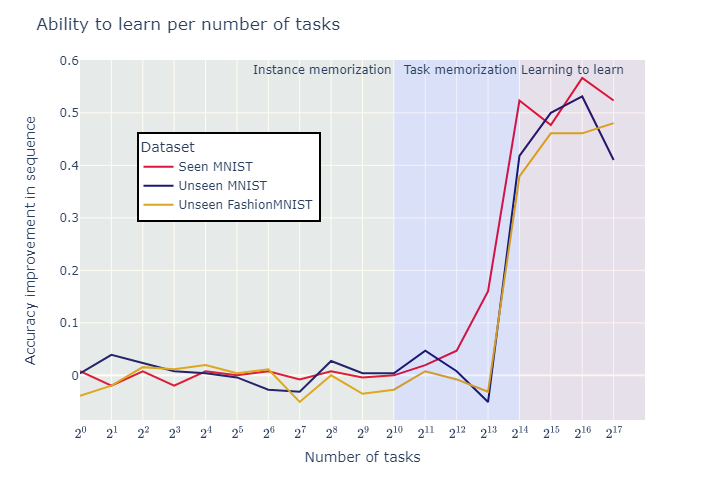

## Отчет 

Это отчёт по воспроизведению результатов статьи [GPICL:
General Purpise In Context Learning](https://arxiv.org/pdf/2212.04458.pdf). В ней рассказывается об удивительном свойстве трснаформиров обучаться учиться, если предоставить им достаточное количество данных. При этом это совсем не обязательно какие-то уникальные данные, достичь такого эффекта можно самыми обычными преобразованиями - проекцией и перестановкой. Также мы посмотрим, как хороши трансформеры в метаобучении, действительно они обобщают или нет, и при каких параметрах это происходит.

### [1. Аугментации данных](https://nbviewer.org/github/Lerostre/gpicl/blob/main/1.%20Task%20generation.ipynb)

Главная мысль статьи - нам не нужно ни большое количество данных, ни какие-то хитрые их аугментации, чтобы обучить модель, которая будет обладать большой обобщающей способностью. Ключевая мысль - взять имеющийся датасет и, путём простых преобразований - линейной проекции инпутов, перестанвокой таргетов, нагенерировать выборку сколь угодно большую. Ниже то, как это должно выглядеть по задумке

Эта часть сделана и работает в лице класса `TaskAugmentor`. Впрочем, авторы статьи отмечают, что это может быть достаточно трудоёмкий процесс, настолько, что требуется 16 GPU. Это действительно так, генерация, сэмплирование, хранение тратит много времени, эта проблема худо-бедно решается, но всё равно есть

### [2. Влияние параметров](https://nbviewer.org/github/Lerostre/gpicl/blob/main/2.%20Hparam%20sweep.ipynb)

Всё обучение нейросетей строится на том, чтобы дать на вход как можно больше самых разных объектов и задач, чтобы в итоге получить модель, которая может вообще всё. Так и авторы статьи решили исследовать, сколько именно аугментаций требуется, и насколько сложная должна быть модель. 

Смотреть это мы будем на примере перцептрона и трансформера. В статье берётся, по всей видимости, encoder-decoder, я же взял decoder-only. Они не уточняют, что должно идти на вход, хотя говорят, что это $[x_1, ... x_n, y1, ... y_m]$ - конкатенация инпута и таргета, но как можно спроецировать из $mathcal{R}$ в дискретное число эмбеддингов? Возможно, что из-за этого результаты не такие внушительные, но они всё же есть

На графике мы видим интересную особенность. Перцептрон, какой бы мощный он не был, не может работать с тасками, которых он никогда не видел, хотя качество при обучении у него отличное. Это говорит о том, что он просто выборку запоминает. Трафнсформер же, если дать достаточно данных, начинает работать, как мета-модель - он учится прямо из контекста, и это по-настоящему поразительно, подробнее это исследуем ниже

### [3. Сравнение моделей](https://nbviewer.org/github/Lerostre/gpicl/blob/main/3.%20Model%20comparison.ipynb) 

Трансформер это не единственная архитектура, которую можно изучать в этом отношении. Как минимум есть ещё и LSTM (у нас обычный, не получилось сделать Outerproduct-LSTM из статьи, слишком времязатратно), VSML (его тоже нет, он написан на `jax`, некогда с ним разбираться), и MAML (он готов, но не хватило времени).

Мы будем сравнивать их качество следующим образом:

1. MLP и MAML это линейные модели, мы будем подавать им 99 примеров, делать градиентный спуск, смотреть на качество на 100
2. LSTM и Transformer - модели seq2seq, они будут принимать 99 объектов, а качество будем сравнивать на последнем векторе контекста по 100 примеру

Обучать всё будем на аугментированном MNIST с числом тасок $2^{16}$. В статье результаты куда более внушительные, но самое главное у нас тоже видно.

К сожалению, сложно сказать, что у нас конкретно пошло не так, но все модели показывают качество заметно хуже. Трансформер возможно из-за decoder-only архитектуры, но с перцептроном всё же непонятно. Возможно связано с тем, что все инпуты были 28x28x1, а не 32x32x3, как в статье. Это сделано просто из соображений экономии памяти, иначе вообще ничего не обучить, но могло повлиять.

Тем не менее, трансформер вновь показывает, что он выучил какие-то такие вещи, которые позволяют ему на совершенно любом датасете показывать вменяемое качество. И скорее всего, этот его потенциал можно многократно развить

### [4. Обучение в контексте](https://nbviewer.org/github/Lerostre/gpicl/blob/main4/.%20Sequence%20metatest.ipynb)

Чтобы убедиться в том, что GPICL действительно черпает информацию из контекста, посмотрим на то, как он от этого контекста зависит. Сперва взглянем на график улучшения аккураси в пределах последовательности. Если он равно 0, значит, модели не важно, 0 объектов ей дано на вход, или все 100, она просто запомнила оптималоьный ответ, либо оптимальное решение задачи. Мы же хотим, чтобы она запомнила, как этой задаче обучиться. Про это график ниже:

Видно, что начиная с определённого момента, где-то в $2^{14}$ задач, происходит фазовый фереход - модель действительно становится метамоделью.

Ещё одна вещь, которую можно посмотреть - как же всё-таки это улучшение происходит. Можно замерить аккураси в зависимости от поданного числа инпутов. Если оно растёт - значит, модель эти знания действительно извлекает. Если нет - модель запоминает

И вновь мы видим, что трансформер это свойство демонстрирует, а значит, потенциально, может использоваться для решения любой задачи, по всей видимости. Это ли не чудо?

### Содержание репозитория

1. [**1. Task generation.ipynb**](https://nbviewer.org/github/Lerostre/gpicl/blob/main/1.%20Task%20generation.ipynb) - Здесь подробное описание того, как генерировать новые таски для задачи обучения GPICL, вместе с примерами
2. [**2. Hparam sweep.ipynb**](https://nbviewer.org/github/Lerostre/gpicl/blob/main/2.%20Hparam%20sweep.ipynb) - Тут мы посмотрим на то, почему трансформер может обобщать, а перцептрон только лишь запоминать, проверим качество на старых и новых для модели тасках в завимиости от параметров
3. [**3. Model comparison.ipynb**](https://nbviewer.org/github/Lerostre/gpicl/blob/main/3.%20Model%20comparison.ipynb) - Тут попробуем сравнить другие модели в роли метамоделей для задачи предсказания 100 объекта, зная 99
4. [**4. Sequence metatest**](https://nbviewer.org/github/Lerostre/gpicl/blob/main4/.%20Sequence%20metatest.ipynb) - Тут посмотрим, как же именно трансформер обобщает и учится извлекать информацию из последовательности
5. [**datagen.py**](https://github.com/Lerostre/gpicl/blob/main/datagen.py) - Здесь всё, что нужно для аугментации данных - проекции, перестановки, интерфейс для обработки датасетов с картинками
6. [**models.py**](https://github.com/Lerostre/gpicl/blob/main/models.py) - Здесь использованные в работе модели
7. [**pl_base.py**](https://github.com/Lerostre/gpicl/blob/main/pl_base.py) - Тут общий для всех моделей интерфейс для обучения с `pytorch-lightning`
7. [**utils.py**](https://github.com/Lerostre/gpicl/blob/main/utils.py) - Здесь в основном то, чему не нашлось места в других модулях. Например, дефолтеые конфиги для моделей
8. [**readme.md**](#report) - Это собственно отчёт о проделанной работе
9. **/experiments/** - В этой папке все эксперименты. В них не так просто разобраться по названиям, лучше смотреть прежде всего в ноутбуки
9. **/src/** - Здесь лежат картинки для отчёта
